# StillShelf

StillShelf is an Android audiobook player for Audiobookshelf.

This project is heavily inspired by the iOS app Still.

It started from a personal need: there were not many Audiobookshelf frontend clients on Android, so this app was built to fill that gap.

The goal is a smooth, practical Android experience for browsing, managing, and listening to your ABS library.

Both m4b and mp3 formats are supported. 

## Building

StillShelf can be built directly from source using Gradle.

Requirements:
- Java 11 or newer
- Android SDK

Build the release APK with:

./gradlew assembleRelease

The generated APK will be located at:

app/build/outputs/apk/release/

## Screenshots

  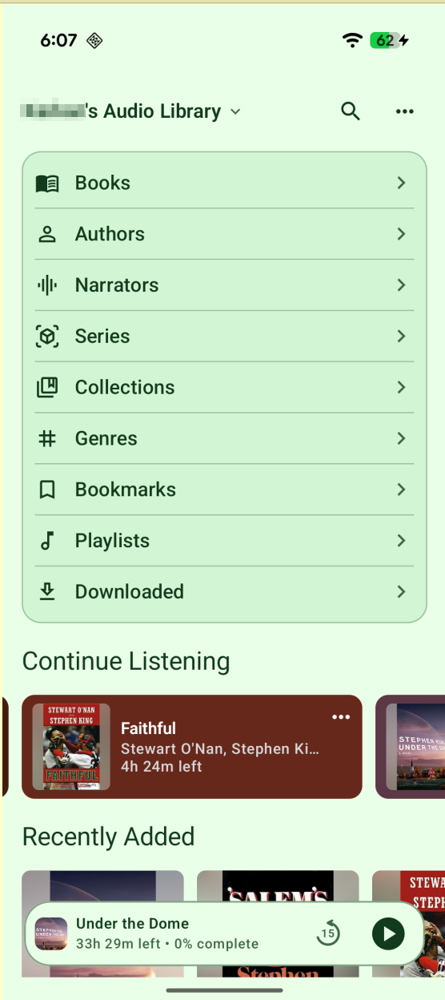
  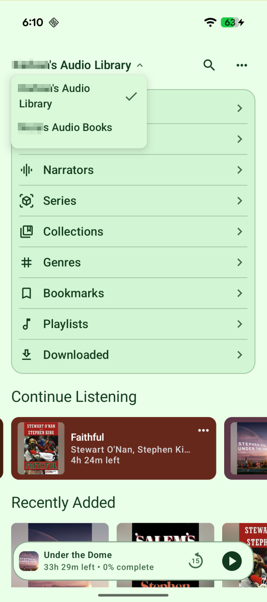
  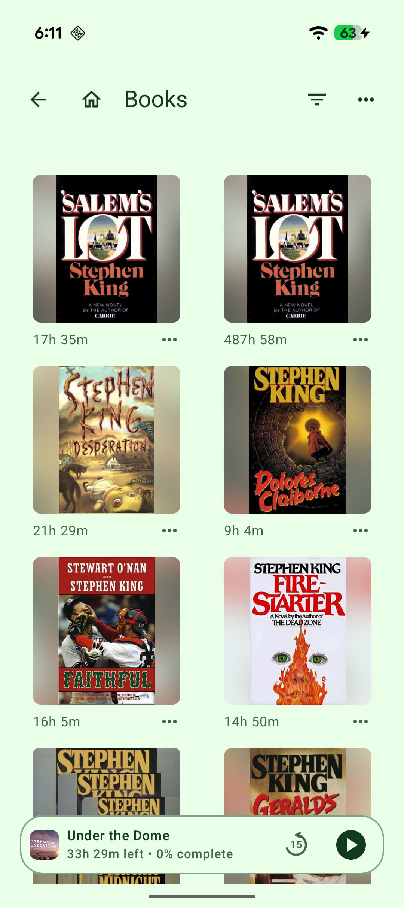

  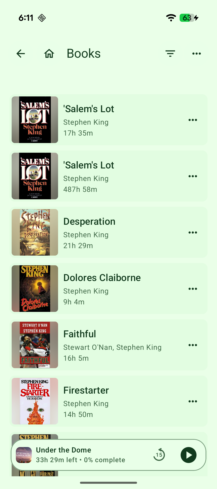
  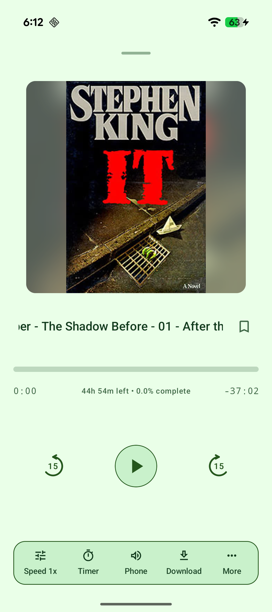
  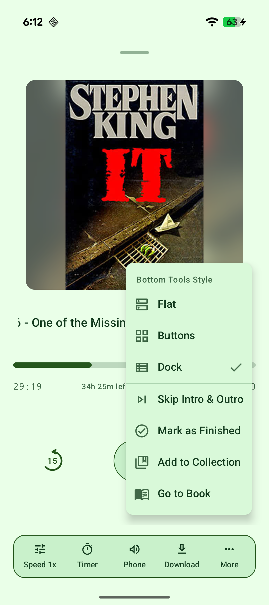

  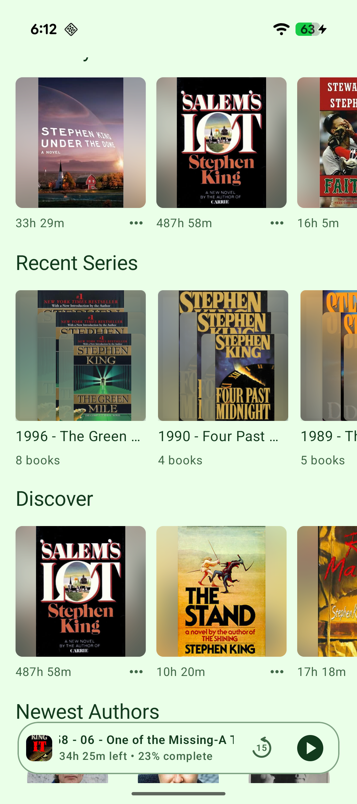
  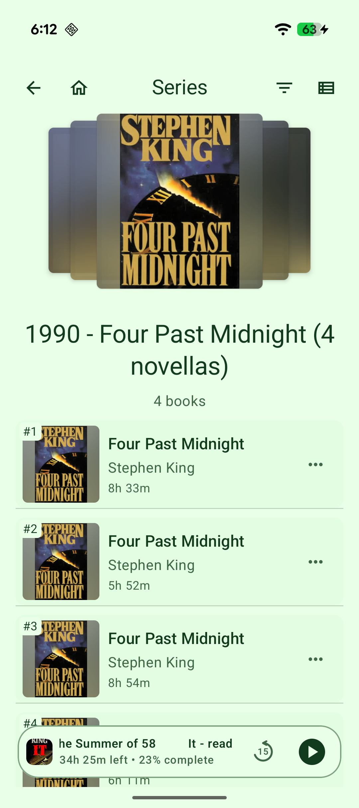
  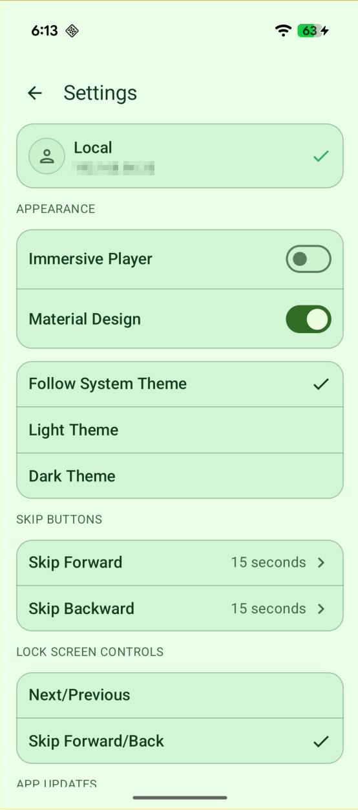

  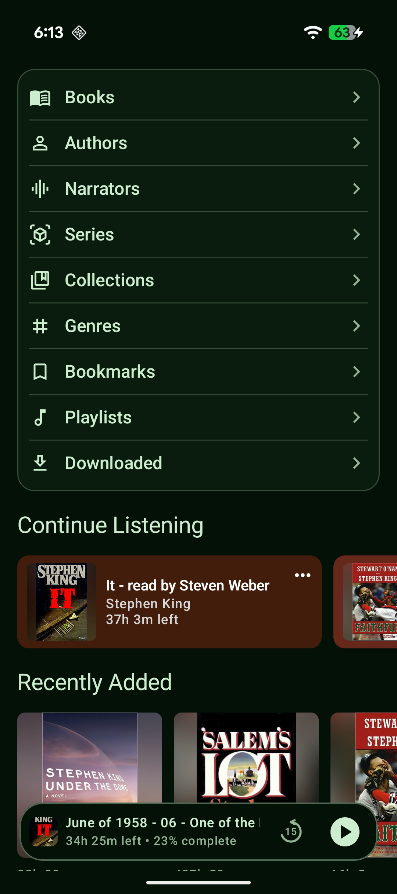
  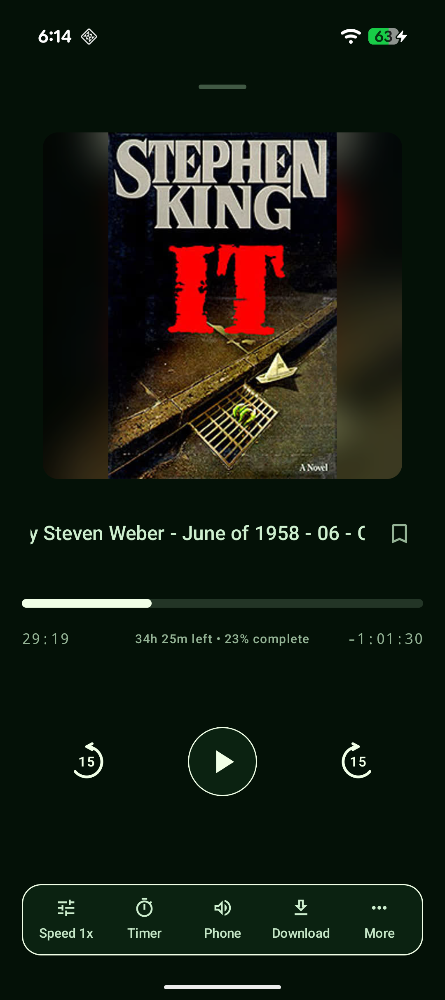
  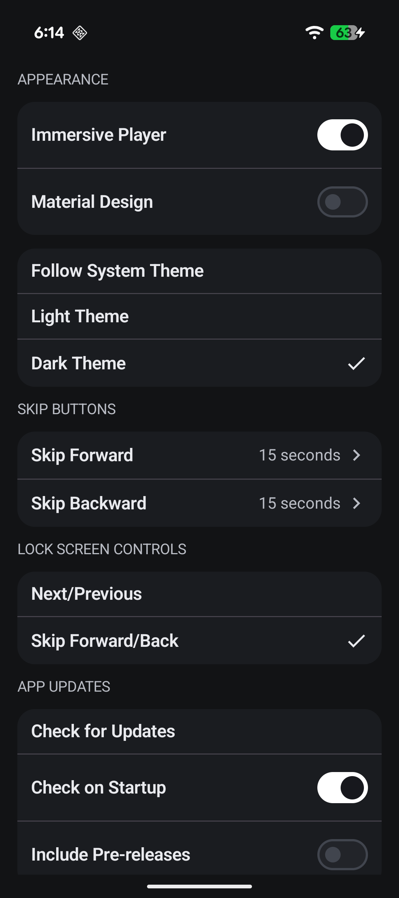

  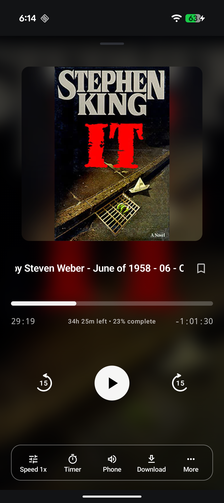

## License

GPL-3.0-only. See [LICENSE](LICENSE).
